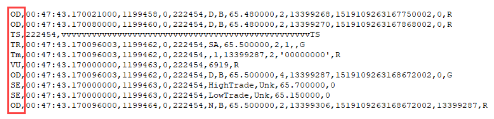

Rest API Output
===============

Message Keys
------------

The message key indicates the type of event for that line and is the first field in every message. The key is always two letters in length and in the upper/lower case specified in this section of the document.

+---------+---------------------------+-------------------------------------------------------------------------------------------------------------------------------------------------------------------------------------------------------------------------------------------------------------------------------+
| FV      | FILE FORMAT VERSION       | The Vertex Standard Format (VSF) version contained in the file and what version this file is compatible with. Always the first message in the file.                                                                                                                           |
+---------+---------------------------+-------------------------------------------------------------------------------------------------------------------------------------------------------------------------------------------------------------------------------------------------------------------------------+
| FC      | FILE COMMENT              | Diagnostic or information to help a person examining the exported file. Can also be used for whitespace and visual separators.                                                                                                                                                |
+---------+---------------------------+-------------------------------------------------------------------------------------------------------------------------------------------------------------------------------------------------------------------------------------------------------------------------------+
| IX      | INSTRUMENT INFO           | Details about the instrument(s) contained in the file. For most files, there will only be one instrument info message, and it will usually appear immediately afte the file format version message.                                                                           |
+---------+---------------------------+-------------------------------------------------------------------------------------------------------------------------------------------------------------------------------------------------------------------------------------------------------------------------------+
| OD      | ORDER DIRECTIVE           | Message that contains information on a quote for all price levels.                                                                                                                                                                                                            |
+---------+---------------------------+-------------------------------------------------------------------------------------------------------------------------------------------------------------------------------------------------------------------------------------------------------------------------------+
| LD      | LEVEL DIRECTIVE           | Message that contains information on a quote that occurred in the first n levels of the book. The instrument definition from the exchange specifies the exact number of levels. This message can show up alongside an OD message.                                             |
+---------+---------------------------+-------------------------------------------------------------------------------------------------------------------------------------------------------------------------------------------------------------------------------------------------------------------------------+
| TR      | TRADE SUMMARY             | Message that contains summary information about trades.                                                                                                                                                                                                                       |
+---------+---------------------------+-------------------------------------------------------------------------------------------------------------------------------------------------------------------------------------------------------------------------------------------------------------------------------+
| Tm      | TRADE MATCH               | Message that contains information on a match of a trade event. The lowercase 'm' is intentional to visually indicate it is a sub-message of the TR message.                                                                                                                   |
+---------+---------------------------+-------------------------------------------------------------------------------------------------------------------------------------------------------------------------------------------------------------------------------------------------------------------------------+
| VU      | VOLUME                    | Message that updates volume data after a trade event. On certain exchanges if two implied quotes are matched, a VU message will appear in the stream showing the change in the total volume, but it will not be tied to a TR event                                            |
+---------+---------------------------+-------------------------------------------------------------------------------------------------------------------------------------------------------------------------------------------------------------------------------------------------------------------------------+
| ST      | DAILY STATISTICS          | Message that provides information about a complete session                                                                                                                                                                                                                    |
+---------+---------------------------+-------------------------------------------------------------------------------------------------------------------------------------------------------------------------------------------------------------------------------------------------------------------------------+
| LM      | LIMITS BANDS              | Message that provides the daily limits for the current session                                                                                                                                                                                                                |
+---------+---------------------------+-------------------------------------------------------------------------------------------------------------------------------------------------------------------------------------------------------------------------------------------------------------------------------+
| SE      | SESSION STATISTICS        | Message that provides information about the session during the session                                                                                                                                                                                                        |
+---------+---------------------------+-------------------------------------------------------------------------------------------------------------------------------------------------------------------------------------------------------------------------------------------------------------------------------+
| SS      | SECURITY STATUS           | Message that provides the security group market state change                                                                                                                                                                                                                  |
+---------+---------------------------+-------------------------------------------------------------------------------------------------------------------------------------------------------------------------------------------------------------------------------------------------------------------------------+
| CR      | CHANNEL RESET             | Message that indicates if the channel the contract is on was reset and at what time                                                                                                                                                                                           |
+---------+---------------------------+-------------------------------------------------------------------------------------------------------------------------------------------------------------------------------------------------------------------------------------------------------------------------------+
| TS / TE | TRANSACTION BUNDLE MARKER | The TS message marks the start of a bundle, and the TE message marks the end of that bundle. The exchange considers all the messages between the start and end marker to have been processed together, regardless of how the packets were split during exchange transmission. |
+---------+---------------------------+-------------------------------------------------------------------------------------------------------------------------------------------------------------------------------------------------------------------------------------------------------------------------------+
| IT      | INVESTIGATED TRADE        | Indicates when a trade is related to an examination by the exchange.                                                                                                                                                                                                          |
+---------+---------------------------+-------------------------------------------------------------------------------------------------------------------------------------------------------------------------------------------------------------------------------------------------------------------------------+
| MU      | MARKUP                    | An alert, automated analysis, or user comment about a particular message or point in time.                                                                                                                                                                                    |
+---------+---------------------------+-------------------------------------------------------------------------------------------------------------------------------------------------------------------------------------------------------------------------------------------------------------------------------+
| EO      | END OF SESSION            | Message that indicates that the session has ended and relays important statistics of the session.                                                                                                                                                                             |
+---------+---------------------------+-------------------------------------------------------------------------------------------------------------------------------------------------------------------------------------------------------------------------------------------------------------------------------+

All Events
----------

Below lists every event type and their detailed attributes. They correspond to the keys listed above.

FILE FORMAT VERSION
~~~~~~~~~~~~~~~~~~~~~~
(Vertex Exclusive)

+--------------------+----------------------------------------------------------------------------------------------------------------------+
| Format             | <Key>,<MsgType>,<Compatible Version>,<Current Version>,<ProdtNameVersion>,<File Contents>,<GeneratedDateTime>        |
+--------------------+----------------------------------------------------------------------------------------------------------------------+
| Example            | FV,V,3.0,3.0,Exporter 3.0,Events,file created on 20180322 09:09:08                                                   |
+--------------------+----------------------------------------------------------------------------------------------------------------------+
| Key                | FV = File Format Version                                                                                             |
+--------------------+----------------------------------------------------------------------------------------------------------------------+
| MsgType            | | R = Real                                                                                                           |
|                    | | V = Vertex                                                                                                         |
|                    | | G = Generated                                                                                                      |
+--------------------+----------------------------------------------------------------------------------------------------------------------+
| Compatible Version | A floating point number that indicates this file is compatible with programs written to read this version, assuming  |
|                    | they follow the best practices in the "Processing the CSV" section of this document. If this number is larger than   |
|                    | you program understands, don't process the file.                                                                     |
+--------------------+----------------------------------------------------------------------------------------------------------------------+
| Current Version    | A floating point number that indicates this file has enhancements. The enhancements are compatible with Compatible   |
|                    | Version, but may have extra fields, new message types, and bug fixes that a newer reader can take advantage of.      |
|                    |                                                                                                                      |
|                    | For example, if Compatible Version is "3.0" but Current Version is "3.1", then it means a "3.0" reader will work, but|
|                    | a "3.1" reader will benefit from improvements in the file format. If this number is larger than you program          |
|                    | understands, that's okay - continue to process the file. At your convenience, you should obtain the latest copy of   |
|                    | this documentation and upgrade your program to receive all the benefits                                              |
+--------------------+----------------------------------------------------------------------------------------------------------------------+

.. Note:: A real message is a message that was received literally from that specific exchange. A generated message has the same format, but it was assembled by Vertex from other message types to provide a consistent output.

INSTRUMENT INFO
~~~~~~~~~~~~~~~~~~~~~~
(Vertex Exclusive)

+--------------+-----------------------------------------------------------------------------------------------------------------------------------------------------------------------------------------------------------------------------------------------------------------------------------------------------------+
| Format       | <Key>,<MsgType>,<InstrID>,<Index>,<Exchange>,<Contract>,<Session Date>,<UTC Offset>,<Channel>,<Root>,<Description>,<VDescription>                                                                                                                                                                         |
+--------------+-----------------------------------------------------------------------------------------------------------------------------------------------------------------------------------------------------------------------------------------------------------------------------------------------------------+
| Example      | IX,V,23252,23252,CME,ESM8,20180321,UTC 0,310,ES,,                                                                                                                                                                                                                                                         |
+--------------+-----------------------------------------------------------------------------------------------------------------------------------------------------------------------------------------------------------------------------------------------------------------------------------------------------------+
| Key          | IX = Instrument Info                                                                                                                                                                                                                                                                                      |
+--------------+-----------------------------------------------------------------------------------------------------------------------------------------------------------------------------------------------------------------------------------------------------------------------------------------------------------+
| MsgType      | | R = Real                                                                                                                                                                                                                                                                                                |
|              | | V = Vertex                                                                                                                                                                                                                                                                                              |
|              | | G = Generated                                                                                                                                                                                                                                                                                           |
+--------------+-----------------------------------------------------------------------------------------------------------------------------------------------------------------------------------------------------------------------------------------------------------------------------------------------------------+
| InstrID      | Unique instrument ID per exchange                                                                                                                                                                                                                                                                         |
+--------------+-----------------------------------------------------------------------------------------------------------------------------------------------------------------------------------------------------------------------------------------------------------------------------------------------------------+
| Index        | Reserved for future use. (Always matches InstrID)                                                                                                                                                                                                                                                         |
+--------------+-----------------------------------------------------------------------------------------------------------------------------------------------------------------------------------------------------------------------------------------------------------------------------------------------------------+
| Exchange     | The name of the exchange that this instrument is from. (This may be useful for decoding exchange specific flags)                                                                                                                                                                                          |
+--------------+-----------------------------------------------------------------------------------------------------------------------------------------------------------------------------------------------------------------------------------------------------------------------------------------------------------+
| Contract     | The contract symbol. (See Symbol Formatting in vNineFeed Rest API; if a wildcard or less specific symbol was provided to the API, this is the exact contract symbol that it selected)                                                                                                                     |
+--------------+-----------------------------------------------------------------------------------------------------------------------------------------------------------------------------------------------------------------------------------------------------------------------------------------------------------+
| Session Date | The date of the session for the events in this file.                                                                                                                                                                                                                                                      |
+--------------+-----------------------------------------------------------------------------------------------------------------------------------------------------------------------------------------------------------------------------------------------------------------------------------------------------------+
| UTC Offset   | The difference between the exchange time and UTC time on the session date. (This should be left blank if unknown)                                                                                                                                                                                         |
+--------------+-----------------------------------------------------------------------------------------------------------------------------------------------------------------------------------------------------------------------------------------------------------------------------------------------------------+
| Channel      | Which channel this instrument trades on for a particular exchange. (Timestamps on the same channel for the same date for the same exchange are usually comparable, because they usually come from the same server. In any other circumstance, the timestamps are usually not accurate to the microsecond) |
+--------------+-----------------------------------------------------------------------------------------------------------------------------------------------------------------------------------------------------------------------------------------------------------------------------------------------------------+
| Root         | The Root Symbol of the contract.                                                                                                                                                                                                                                                                          |
+--------------+-----------------------------------------------------------------------------------------------------------------------------------------------------------------------------------------------------------------------------------------------------------------------------------------------------------+
| Description  | The exchange provided instrument description. (May be blank)                                                                                                                                                                                                                                              |
+--------------+-----------------------------------------------------------------------------------------------------------------------------------------------------------------------------------------------------------------------------------------------------------------------------------------------------------+
| VDescription | The Vertex provided instrument description. (May be blank)                                                                                                                                                                                                                                                |
+--------------+-----------------------------------------------------------------------------------------------------------------------------------------------------------------------------------------------------------------------------------------------------------------------------------------------------------+

FILE COMMENT
~~~~~~~~~~~~~~~
(Vertex Exclusive)

+-------------+---------------------------------------------------------------------------------------------------------------------------------------------------------------------------------------------------------------+
| Format      | <Key>,<MsgType>,<Type>,<Description>                                                                                                                                                                          |
+-------------+---------------------------------------------------------------------------------------------------------------------------------------------------------------------------------------------------------------+
| Example     | FC,V,END,generation time 27391 mSec                                                                                                                                                                           |
+-------------+---------------------------------------------------------------------------------------------------------------------------------------------------------------------------------------------------------------+
| Key         | FC = File Comment                                                                                                                                                                                             |
+-------------+---------------------------------------------------------------------------------------------------------------------------------------------------------------------------------------------------------------+
| MsgType     | | R = Real                                                                                                                                                                                                    |
|             | | V = Vertex                                                                                                                                                                                                  |
|             | | G = Generated                                                                                                                                                                                               |
+-------------+---------------------------------------------------------------------------------------------------------------------------------------------------------------------------------------------------------------+
| Type        | | DATA = Regarding data - possibly because there isn't any data. Reason is in the description. This isn't necessarily a problem if a lack of data is expected depending on the instrument, date, or query type|
|             | | END = indicates that this is the expected end of the file for processing.                                                                                                                                   |
|             | | STAT = Progress or other message appropriate to show on a UI.                                                                                                                                               |
|             | | LOG = write the Description to your log                                                                                                                                                                     |
|             | | WARN = log and alert operator, but continue processing                                                                                                                                                      |
|             | | ERROR = log, alert operator, stop processing                                                                                                                                                                |
+-------------+---------------------------------------------------------------------------------------------------------------------------------------------------------------------------------------------------------------+
| Description | Text related to the message type. Usually quoted due to commas. Can be blank                                                                                                                                  |
+-------------+---------------------------------------------------------------------------------------------------------------------------------------------------------------------------------------------------------------+

ORDER DIRECTIVE
~~~~~~~~~~~~~~~~~~

+-----------------+-----------------------------------------------------------------------------------------------------------------------------------------------------------------------------------------------------------+
| Format          | <Key>,<MsgType>,<Time>,<cSeq>,<iSeq>,<InstrID>,<Book Type>,<Event Indicator>,<Price>, <Qty>,<PriorityID>,<OrigOrderID>                                                                                    |
+-----------------+-----------------------------------------------------------------------------------------------------------------------------------------------------------------------------------------------------------+
| Example         | OD,R,21:00:00.008519490,15379216,0,23252,S,D,271800.000000,1,5875793362,644724607591                                                                                                                      |
+-----------------+-----------------------------------------------------------------------------------------------------------------------------------------------------------------------------------------------------------+
| Key             | OD = Order Directive                                                                                                                                                                                      |
+-----------------+-----------------------------------------------------------------------------------------------------------------------------------------------------------------------------------------------------------+
| MsgType         | | R = Real                                                                                                                                                                                                |
|                 | | V = Vertex                                                                                                                                                                                              |
|                 | | G = Generated                                                                                                                                                                                           |
+-----------------+-----------------------------------------------------------------------------------------------------------------------------------------------------------------------------------------------------------+
| Time            | Timestamp of when the event was recorded by the exchange                                                                                                                                                  |
+-----------------+-----------------------------------------------------------------------------------------------------------------------------------------------------------------------------------------------------------+
| Description     | Text related to the message type. Usually quoted due to commas. Can be blank                                                                                                                              |
+-----------------+-----------------------------------------------------------------------------------------------------------------------------------------------------------------------------------------------------------+
| cSeq            | Channel level sequence number                                                                                                                                                                             |
+-----------------+-----------------------------------------------------------------------------------------------------------------------------------------------------------------------------------------------------------+
| iSeq            | Instrument level sequence number                                                                                                                                                                          |
+-----------------+-----------------------------------------------------------------------------------------------------------------------------------------------------------------------------------------------------------+
| InstrID         | Unique instrument ID per exchange                                                                                                                                                                         |
+-----------------+-----------------------------------------------------------------------------------------------------------------------------------------------------------------------------------------------------------+
| Book Type       | | B = Bid                                                                                                                                                                                                 |
|                 | | S = Offer/Sell                                                                                                                                                                                          |
|                 | | EOE = End of directive sequence                                                                                                                                                                         |
|                 | | iB = Implied Bid, iS = Implied Offer/Sell,                                                                                                                                                              |
|                 | | R = Reset Book                                                                                                                                                                                          |
|                 | | U = Unknown or not set                                                                                                                                                                                  |
+-----------------+-----------------------------------------------------------------------------------------------------------------------------------------------------------------------------------------------------------+
| Event Indicator | | C = Change                                                                                                                                                                                              |
|                 | | D = Delete, DF = Delete From, DT = Delete Thru                                                                                                                                                          |
|                 | | N = New                                                                                                                                                                                                 |
|                 | | O = Overlay (i.e. building book from good til cancelled)                                                                                                                                                |
|                 | | R = Replace                                                                                                                                                                                             |
|                 | | U = Unknown or not set                                                                                                                                                                                  |
+-----------------+-----------------------------------------------------------------------------------------------------------------------------------------------------------------------------------------------------------+
| Price           | Price at which the event occurred                                                                                                                                                                         |
+-----------------+-----------------------------------------------------------------------------------------------------------------------------------------------------------------------------------------------------------+
| Qty             | Total quantity matched for this trade event                                                                                                                                                               |
+-----------------+-----------------------------------------------------------------------------------------------------------------------------------------------------------------------------------------------------------+
| PriorityID      | Order priority for execution on the order book. A lower value is a higher priority                                                                                                                        |
+-----------------+-----------------------------------------------------------------------------------------------------------------------------------------------------------------------------------------------------------+
| OrigOrderID     | The first OrderID assigned. Some exchanges change the orderID of an order. This field allows you to always know what the original ID was for any order. CME 'OD' messages will only have up to this field |
+-----------------+-----------------------------------------------------------------------------------------------------------------------------------------------------------------------------------------------------------+
| CurrentOrderID  | If an exchange changes an order's OrderID, this is the new OrderID it was changed to. ICE 'OD' messages stop at this field                                                                                |
+-----------------+-----------------------------------------------------------------------------------------------------------------------------------------------------------------------------------------------------------+
| PrevOrderID     | If an orders ID is changed multiple times this is the ID that was just replaced. Eurex 'OD' messages have up to this field.                                                                               |
+-----------------+-----------------------------------------------------------------------------------------------------------------------------------------------------------------------------------------------------------+

LEVEL DIRECTIVE
~~~~~~~~~~~~~~~~~~

+-------------------+------------------------------------------------------------------------------------------------------------------------------------------------------------+
| Format            | <Key>,<MsgType>,<Time>,<cSeq>,<iSeq>,<InstrID>,<Book Type>,<Event Indicator>,<PriceLevel>,<Price>,<AggQty>, <NumOrders>,<ImpliedAggQty>,<ImpliedNumOrders> |
+-------------------+------------------------------------------------------------------------------------------------------------------------------------------------------------+
| Example           | LD,R,19:05:14.432725899,14376680,15065699,23252,S,N,10,272600.000000,268,102,0,0                                                                           |
+-------------------+------------------------------------------------------------------------------------------------------------------------------------------------------------+
| Key               | LD = Level Directive                                                                                                                                       |
+-------------------+------------------------------------------------------------------------------------------------------------------------------------------------------------+
| MsgType           | | R = Real                                                                                                                                                 |
|                   | | V = Vertex                                                                                                                                               |
|                   | | G = Generated                                                                                                                                            |
+-------------------+------------------------------------------------------------------------------------------------------------------------------------------------------------+
| Time              | Timestamp of when the event was recorded by the exchange                                                                                                   |
+-------------------+------------------------------------------------------------------------------------------------------------------------------------------------------------+
| cSeq              | Channel level sequence number                                                                                                                              |
+-------------------+------------------------------------------------------------------------------------------------------------------------------------------------------------+
| iSeq              | Instrument level sequence number                                                                                                                           |
+-------------------+------------------------------------------------------------------------------------------------------------------------------------------------------------+
| InstrID           | Unique instrument ID per exchange                                                                                                                          |
+-------------------+------------------------------------------------------------------------------------------------------------------------------------------------------------+
| Book Type         | | B = Bid                                                                                                                                                  |
|                   | | S = Offer/Sell                                                                                                                                           |
|                   | | EOE = End of directive sequence                                                                                                                          |
|                   | | iB = Implied Bid, iS = Implied Offer/Sell,                                                                                                               |
|                   | | R = Reset Book                                                                                                                                           |
|                   | | U = Unknown or not set                                                                                                                                   |
+-------------------+------------------------------------------------------------------------------------------------------------------------------------------------------------+
| Event Indicator   | | C = Change                                                                                                                                               |
|                   | | D = Delete, DF = Delete From, DT = Delete Thru                                                                                                           |
|                   | | N = New                                                                                                                                                  |
|                   | | O = Overlay (i.e. building book from good til cancelled)                                                                                                 |
|                   | | R = Replace                                                                                                                                              |
|                   | | U = Unknown or not set                                                                                                                                   |
+-------------------+------------------------------------------------------------------------------------------------------------------------------------------------------------+
| Price Level       | Price level at which the event occurred                                                                                                                    |
+-------------------+------------------------------------------------------------------------------------------------------------------------------------------------------------+
| Price             | Price at which the event occurred                                                                                                                          |
+-------------------+------------------------------------------------------------------------------------------------------------------------------------------------------------+
| AggQty            | Total quantity at the price level                                                                                                                          |
+-------------------+------------------------------------------------------------------------------------------------------------------------------------------------------------+
| NumOrders         | Total number of orders at the price level                                                                                                                  |
+-------------------+------------------------------------------------------------------------------------------------------------------------------------------------------------+
| Implied AggQty    | Total implied quantity at the price level                                                                                                                  |
+-------------------+------------------------------------------------------------------------------------------------------------------------------------------------------------+
| Implied NumOrders | Total number of implied orders at the price level                                                                                                          |
+-------------------+------------------------------------------------------------------------------------------------------------------------------------------------------------+

TRADE SUMMARY
~~~~~~~~~~~~~~~~

+--------------------+---------------------------------------------------------------------------------------------------------------------+
| Format             | <Key>,<MsgType>,<Time>,<cSeq>,<iSeq>,<InstrID>,<AggressorSide>,<Price>,<TradeQty>,<NumMatches>,<Implied Indication> |
+--------------------+---------------------------------------------------------------------------------------------------------------------+
| Example            | TR,R,23:04:10.230954967,10451092,10982857,23252,BA,272225.000000,1,2                                                |
+--------------------+---------------------------------------------------------------------------------------------------------------------+
| Key                | TR = Trade Summary                                                                                                  |
+--------------------+---------------------------------------------------------------------------------------------------------------------+
| MsgType            | | R = Real                                                                                                          |
|                    | | V = Vertex                                                                                                        |
|                    | | G = Generated                                                                                                     |
+--------------------+---------------------------------------------------------------------------------------------------------------------+
| Time               | Timestamp of when the event was recorded by the exchange                                                            |
+--------------------+---------------------------------------------------------------------------------------------------------------------+
| cSeq               | Channel level sequence number                                                                                       |
+--------------------+---------------------------------------------------------------------------------------------------------------------+
| iSeq               | Instrument level sequence number                                                                                    |
+--------------------+---------------------------------------------------------------------------------------------------------------------+
| InstrID            | Unique instrument ID per exchange                                                                                   |
+--------------------+---------------------------------------------------------------------------------------------------------------------+
| Aggressor Side     | | BA = Buy Aggressor                                                                                                |
|                    | | SA = Sell Aggressor                                                                                               |
|                    | | NA = No Aggressor                                                                                                 |
+--------------------+---------------------------------------------------------------------------------------------------------------------+
| Price              | Price at which the event occurred                                                                                   |
+--------------------+---------------------------------------------------------------------------------------------------------------------+
| Trade Qty          | Total quantity matched for this trade event                                                                         |
+--------------------+---------------------------------------------------------------------------------------------------------------------+
| NumMatches         | Identifies the total number of orders that participated in this match event                                         |
+--------------------+---------------------------------------------------------------------------------------------------------------------+
| Implied Indication | I = implied aggressor. Otherwise, this option is left blank                                                         |
+--------------------+---------------------------------------------------------------------------------------------------------------------+

TRADE MATCH
~~~~~~~~~~~~~~

+----------------------+---------------------------------------------------------------------------------------------------------------------------------------------------------------------------------------------------------------------+
| Format               | <Key>,<MsgType>,<Time>,<cSeq>,<iSeq>,<InstrID>,<AggressorIndication>,<MatchNum>,<OrderID>,<Qty>,<Flags>                                                                                                             |
+----------------------+---------------------------------------------------------------------------------------------------------------------------------------------------------------------------------------------------------------------+
| Example              | Tm,R,23:04:10.230389983,10451088,10982854,23252,,4,644721959581,1,'00000000'                                                                                                                                        |
+----------------------+---------------------------------------------------------------------------------------------------------------------------------------------------------------------------------------------------------------------+
| Key                  | Tm = Trade Match                                                                                                                                                                                                    |
+----------------------+---------------------------------------------------------------------------------------------------------------------------------------------------------------------------------------------------------------------+
| MsgType              | | R = Real                                                                                                                                                                                                          |
|                      | | V = Vertex                                                                                                                                                                                                        |
|                      | | G = Generated                                                                                                                                                                                                     |
+----------------------+---------------------------------------------------------------------------------------------------------------------------------------------------------------------------------------------------------------------+
| Time                 | Timestamp of when the event was recorded by the exchange                                                                                                                                                            |
+----------------------+---------------------------------------------------------------------------------------------------------------------------------------------------------------------------------------------------------------------+
| cSeq                 | Channel level sequence number                                                                                                                                                                                       |
+----------------------+---------------------------------------------------------------------------------------------------------------------------------------------------------------------------------------------------------------------+
| iSeq                 | Instrument level sequence number                                                                                                                                                                                    |
+----------------------+---------------------------------------------------------------------------------------------------------------------------------------------------------------------------------------------------------------------+
| InstrID              | Unique instrument ID per exchange                                                                                                                                                                                   |
+----------------------+---------------------------------------------------------------------------------------------------------------------------------------------------------------------------------------------------------------------+
| Aggressor Indication | All Trade match messages currently have this field blank                                                                                                                                                            |
+----------------------+---------------------------------------------------------------------------------------------------------------------------------------------------------------------------------------------------------------------+
| MatchNum             | OrderID's assigned Match number                                                                                                                                                                                     |
+----------------------+---------------------------------------------------------------------------------------------------------------------------------------------------------------------------------------------------------------------+
| OrderID              | OrderID for the order that was matched                                                                                                                                                                              |
+----------------------+---------------------------------------------------------------------------------------------------------------------------------------------------------------------------------------------------------------------+
| Qty                  | Quantity matched for this order                                                                                                                                                                                     |
+----------------------+---------------------------------------------------------------------------------------------------------------------------------------------------------------------------------------------------------------------+
| Flags                | | These bits are exchange specific. If you don't know which exchange this file came from, the exchange for this instrId is located in the Instrument Information message.                                           |
|                      | |                                                                                                                                                                                                                   |
|                      | | 00000001: IsRFCCrossing - indicates this is a RFC Crossing Deal                                                                                                                                                   |
|                      | | 00000010: IsLegDealOutsideIPL - indicates the deal is outside of IPL (if IPL enabled)                                                                                                                             |
|                      | | When set, the deal should not be included in market stats. This could only happen in leg markets due to implied orders                                                                                            |
|                      | | 00000100: IsImplied - indicates that the originator side of the deal resulted from implied order.                                                                                                                 |
|                      | | This field should not be used to determine how market statistics are calculated                                                                                                                                   |
|                      | | 00001000: isVerticalSplit - indicates if the trade is a system priced leg from a composite strategy                                                                                                               |
|                      | | 11110000: Reserved for future use                                                                                                                                                                                 |
+----------------------+---------------------------------------------------------------------------------------------------------------------------------------------------------------------------------------------------------------------+

.. Note:: The lowercase 'm' in Tm is intentional. It is there to visually indicate it is a sub-message of the TR message

VOLUME
~~~~~~~~~

+---------+-------------------------------------------------------------+
| Format  | <Key>,<MsgType>,<Time>,<cSeq>,<iSeq>,<InstrID>,<Vol>        |
+---------+-------------------------------------------------------------+
| Example | VU,R,23:04:10.230389983,10451089,10982855,23252,6243        |
+---------+-------------------------------------------------------------+
| Key     | VU = Volume                                                 |
+---------+-------------------------------------------------------------+
| MsgType | | R = Real                                                  |
|         | | V = Vertex                                                |
|         | | G = Generated                                             |
+---------+-------------------------------------------------------------+
| Time    | Timestamp of when the event was recorded by the exchange    |
+---------+-------------------------------------------------------------+
| cSeq    | Channel level sequence number                               |
+---------+-------------------------------------------------------------+
| iSeq    | Instrument level sequence number                            |
+---------+-------------------------------------------------------------+
| InstrID | Unique instrument ID per exchange                           |
+---------+-------------------------------------------------------------+
| Vol     | Total volume for the session including the last trade event |
+---------+-------------------------------------------------------------+

DAILY STATISTICS
~~~~~~~~~~~~~~~~~~~

+---------+-----------------------------------------------------------------------------------------------------+
| Format  | <Key>,<MsgType>,<Time>,<cSeq>,<iSeq>,<InstrID>,<Type>,<Flags>,<Price>,<Qty>,<Date>                  |
+---------+-----------------------------------------------------------------------------------------------------+
| Example | ST,R,23:10:08.211654892,10452851,10984078,23252,SettlementPrice,'00000111',272350.000000,0,20180320 |
+---------+-----------------------------------------------------------------------------------------------------+
| Key     | ST = Statistics                                                                                     |
+---------+-----------------------------------------------------------------------------------------------------+
| MsgType | | R = Real                                                                                          |
|         | | V = Vertex                                                                                        |
|         | | G = Generated                                                                                     |
+---------+-----------------------------------------------------------------------------------------------------+
| Time    | Timestamp of when the event was recorded by the exchange                                            |
+---------+-----------------------------------------------------------------------------------------------------+
| cSeq    | Channel level sequence number                                                                       |
+---------+-----------------------------------------------------------------------------------------------------+
| iSeq    | Instrument level sequence number                                                                    |
+---------+-----------------------------------------------------------------------------------------------------+
| InstrID | Unique instrument ID per exchange                                                                   |
+---------+-----------------------------------------------------------------------------------------------------+
| Type    | | SettlementPrice                                                                                   |
|         | | ClearedVolume                                                                                     |
|         | | OpenInterest                                                                                      |
|         | | FixingPrice                                                                                       |
+---------+-----------------------------------------------------------------------------------------------------+
| Flags   | | 00000001: Final                                                                                   |
|         | | 00000010: Actual                                                                                  |
|         | | 00000100: Rounded                                                                                 |
|         | | 00001000: Intraday                                                                                |
|         | | 01110000: Reserved flags                                                                          |
|         | | 10000000: Null value                                                                              |
+---------+-----------------------------------------------------------------------------------------------------+
| Price   | Price of the statistic                                                                              |
+---------+-----------------------------------------------------------------------------------------------------+
| Qty     | Total Quantity                                                                                      |
+---------+-----------------------------------------------------------------------------------------------------+
| Date    | Date of the trading session for this statistic                                                      |
+---------+-----------------------------------------------------------------------------------------------------+

LIMIT BANDS
~~~~~~~~~~~~~~~

+---------------------+-------------------------------------------------------------------------------------------------------+
| Format              | <Key>,<MsgType>,<Time>,<cSeq>,<iSeq>,<InstrID>,<LowLimitPrice>,<HighLimitPrice>,<Max Price Variation> |
+---------------------+-------------------------------------------------------------------------------------------------------+
| Example             | LM,R,23:10:08.211654892,10452852,10984079,23252,258400.000000,285500.000000,600.000000                |
+---------------------+-------------------------------------------------------------------------------------------------------+
| Key                 | LM = Limit                                                                                            |
+---------------------+-------------------------------------------------------------------------------------------------------+
| MsgType             | | R = Real                                                                                            |
|                     | | V = Vertex                                                                                          |
|                     | | G = Generated                                                                                       |
+---------------------+-------------------------------------------------------------------------------------------------------+
| Time                | Timestamp of when the event was recorded by the exchange                                              |
+---------------------+-------------------------------------------------------------------------------------------------------+
| cSeq                | Channel level sequence number                                                                         |
+---------------------+-------------------------------------------------------------------------------------------------------+
| iSeq                | Instrument level sequence number                                                                      |
+---------------------+-------------------------------------------------------------------------------------------------------+
| InstrID             | Unique instrument ID per exchange                                                                     |
+---------------------+-------------------------------------------------------------------------------------------------------+
| LowLimitPrice       | Lowest price level the contract can trade in this session                                             |
+---------------------+-------------------------------------------------------------------------------------------------------+
| HighLimitPrice      | Highest price level the contract can trade in this session                                            |
+---------------------+-------------------------------------------------------------------------------------------------------+
| Max Price Variation | Max tradable range for this session                                                                   |
+---------------------+-------------------------------------------------------------------------------------------------------+

SESSION STATISTICS
~~~~~~~~~~~~~~~~~~~~~~

+---------+--------------------------------------------------------------------------------------------------+
| Format  | <Key>,<MsgType>,<Time>,<cSeq>,<iSeq>,<InstrID>,<Type>,<SubType>,<Price>,<Qty>                    |
+---------+--------------------------------------------------------------------------------------------------+
| Example | SE,R,21:45:03.816284575,10421360,10963420,23252,OpenPrice,IndicativeOpeningPrice,272325.000000,4 |
+---------+--------------------------------------------------------------------------------------------------+
| Key     | SE = Session                                                                                     |
+---------+--------------------------------------------------------------------------------------------------+
| MsgType | | R = Real                                                                                       |
|         | | V = Vertex                                                                                     |
|         | | G = Generated                                                                                  |
+---------+--------------------------------------------------------------------------------------------------+
| Time    | Timestamp of when the event was recorded by the exchange                                         |
+---------+--------------------------------------------------------------------------------------------------+
| cSeq    | Channel level sequence number                                                                    |
+---------+--------------------------------------------------------------------------------------------------+
| iSeq    | Instrument level sequence number                                                                 |
+---------+--------------------------------------------------------------------------------------------------+
| InstrID | Unique instrument ID per exchange                                                                |
+---------+--------------------------------------------------------------------------------------------------+
| Type    | | OpenPrice                                                                                      |
|         | | HighTrade                                                                                      |
|         | | LowTrade                                                                                       |
|         | | HighBid                                                                                        |
|         | | LowOffer                                                                                       |
+---------+--------------------------------------------------------------------------------------------------+
| SubType | | DailyOpenPrice                                                                                 |
|         | | IndicativeOpeningPrice                                                                         |
+---------+--------------------------------------------------------------------------------------------------+
| Price   | Price of the statistic                                                                           |
+---------+--------------------------------------------------------------------------------------------------+
| Qty     | Quantity at the price level, if null the value 2147483647 will be there                          |
+---------+--------------------------------------------------------------------------------------------------+

SECURITY STATUS
~~~~~~~~~~~~~~~~~~~

+---------------+--------------------------------------------------------------------------------------------------+
| Format        | <Key>,<MsgType>,<Time>,<cSeq>,<iSeq>,<InstrID>,<Type>,<SubType>,<Price>,<Qty>                    |
+---------------+--------------------------------------------------------------------------------------------------+
| Example       | SE,R,21:45:03.816284575,10421360,10963420,23252,OpenPrice,IndicativeOpeningPrice,272325.000000,4 |
+---------------+--------------------------------------------------------------------------------------------------+
| Key           | SE = Session                                                                                     |
+---------------+--------------------------------------------------------------------------------------------------+
| MsgType       | | R = Real                                                                                       |
|               | | V = Vertex                                                                                     |
|               | | G = Generated                                                                                  |
+---------------+--------------------------------------------------------------------------------------------------+
| Time          | Timestamp of when the event was recorded by the exchange                                         |
+---------------+--------------------------------------------------------------------------------------------------+
| cSeq          | Channel level sequence number                                                                    |
+---------------+--------------------------------------------------------------------------------------------------+
| iSeq          | Instrument level sequence number                                                                 |
+---------------+--------------------------------------------------------------------------------------------------+
| InstrID       | Unique instrument ID per exchange                                                                |
+---------------+--------------------------------------------------------------------------------------------------+
| Status        | | TradingHalt                                                                                    |
|               | | Close                                                                                          |
|               | | NewPriceIndication                                                                             |
|               | | ReadyToTrade                                                                                   |
|               | | NotAvailableForTrading                                                                         |
|               | | UnknownorInvalid                                                                               |
|               | | PreOpen                                                                                        |
|               | | PreCross                                                                                       |
|               | | Cross                                                                                          |
|               | | PostClose                                                                                      |
|               | | NoChange                                                                                       |
|               | | Restricted                                                                                     |
|               | | Freeze                                                                                         |
+---------------+--------------------------------------------------------------------------------------------------+
| Reason        | | GroupSchedule                                                                                  |
|               | | SurveillanceIntervention                                                                       |
|               | | MarketEvent                                                                                    |
|               | | InstrumentActivation                                                                           |
|               | | InstrumentExpiration                                                                           |
|               | | Unknown                                                                                        |
|               | | RecoverInProcess                                                                               |
+---------------+--------------------------------------------------------------------------------------------------+
| Trading Event | | "Blank" - there could be no value                                                              |
|               | | NoCancel                                                                                       |
|               | | ResetStatistics                                                                                |
|               | | ImpliedMatchingON                                                                              |
|               | | ImpliedMatchingOFF                                                                             |
+---------------+--------------------------------------------------------------------------------------------------+
| Date          | Date of the trading session for this statistic                                                   |
+---------------+--------------------------------------------------------------------------------------------------+
| Group         | An exchange specific code assigned to a group of related securities, which are concurrently      |
|               | affected by market events                                                                        |
+---------------+--------------------------------------------------------------------------------------------------+
| Asset         | String field that indicates the underlying asset code                                            |
+---------------+--------------------------------------------------------------------------------------------------+

CHANNEL RESET
~~~~~~~~~~~~~~~~~

+-------------+----------------------------------------------------------+
| Format      | <Key>,<MsgType>,<Time>,<cSeq>,<InstrID>,<Description>    |
+-------------+----------------------------------------------------------+
| Example     | CR,R,18:58:00.063000000,25765,222454, "Channel Reset"    |
+-------------+----------------------------------------------------------+
| Key         | CR = Channel Reset                                       |
+-------------+----------------------------------------------------------+
| MsgType     | | R = Real                                               |
|             | | V = Vertex                                             |
|             | | G = Generated                                          |
+-------------+----------------------------------------------------------+
| Time        | Timestamp of when the event was recorded by the exchange |
+-------------+----------------------------------------------------------+
| cSeq        | Channel level sequence number                            |
+-------------+----------------------------------------------------------+
| iSeq        | Instrument level sequence number                         |
+-------------+----------------------------------------------------------+
| InstrID     | Unique instrument ID per exchange                        |
+-------------+----------------------------------------------------------+
| Description | Reason for the CR message                                |
+-------------+----------------------------------------------------------+

TRANSACTION BUNDLE MARKER
~~~~~~~~~~~~~~~~~~~~~~~~~~~~~

+---------------+-------------------------------------------------+
| Format        | <Key>,<MsgType>,<InsterID>,<Visual Marker>      |
+---------------+-------------------------------------------------+
| Examples      | | TS,G,222454,vvvvvvvvvvvvvvvvvvvvvvvvvvvvvvvTS |
|               | | TE,G,222454,^^^^^^^^^^^^^^^^^^^^^^^^^^^^^^TE  |
+---------------+-------------------------------------------------+
| Key           | | TS = Transaction Start                        |
|               | | TE = Transaction End                          |
+---------------+-------------------------------------------------+
| MsgType       | | R = Real                                      |
|               | | V = Vertex                                    |
|               | | G = Generated                                 |
+---------------+-------------------------------------------------+
| InstrID       | Unique instrument ID per exchange               |
+---------------+-------------------------------------------------+
| Visual Marker | Please ignore. This is for visuals only         |
+---------------+-------------------------------------------------+

MARKUP
~~~~~~~~
(Vertex Exclusive)

+-------------+-------------------------------------------------------------------------------------------------------------------------------------------------------------------------------------------------------+
| Format      | <Key>,<MsgType>,<Time>,<cSeq>,<iSeq>,<InstrID>,<Type>,<MarkupID>,<Price>,<Color>,<Marker>,<Title>,<Description>                                                                                       |
+-------------+-------------------------------------------------------------------------------------------------------------------------------------------------------------------------------------------------------+
| Example     | MU,V,23:04:10.230389983,10451088,10982854,23252,U,1257,64.8200,#FF0000,9733,ryan,Big Move                                                                                                             |
+-------------+-------------------------------------------------------------------------------------------------------------------------------------------------------------------------------------------------------+
| Key         | MU = MarkUp                                                                                                                                                                                           |
+-------------+-------------------------------------------------------------------------------------------------------------------------------------------------------------------------------------------------------+
| MsgType     | | R = Real                                                                                                                                                                                            |
|             | | V = Vertex                                                                                                                                                                                          |
|             | | G = Generated                                                                                                                                                                                       |
+-------------+-------------------------------------------------------------------------------------------------------------------------------------------------------------------------------------------------------+
| Time        | Point in the event timeline of which the markup refers. (This allows markup even in periods when an event did not occur)                                                                              |
+-------------+-------------------------------------------------------------------------------------------------------------------------------------------------------------------------------------------------------+
| cSeq        | Channel level sequence number that the markup refers to. (Can be 0)                                                                                                                                   |
+-------------+-------------------------------------------------------------------------------------------------------------------------------------------------------------------------------------------------------+
| iSeq        | Instrument level sequence number that the markup refers to. (Can be 0)                                                                                                                                |
+-------------+-------------------------------------------------------------------------------------------------------------------------------------------------------------------------------------------------------+
| InstrID     | Instrument ID that the markup refers to. (Can be 0)                                                                                                                                                   |
+-------------+-------------------------------------------------------------------------------------------------------------------------------------------------------------------------------------------------------+
| Type        | | A = Association. Two or more exchange messages are related to each other in a manner indicated by the Title.                                                                                        |
|             | | F = Trade Activity Feed. One or more events/quotes are yours.                                                                                                                                       |
|             | | P = Pattern. One or more messages are a detectable pattern in a manner indicated by the Title.                                                                                                      |
|             | | R = Result (i.e. how the quote turned out), indicated by the Title.                                                                                                                                 |
|             | | S = Scan. One or more messages came from a vNine client scan.                                                                                                                                       |
|             | | U = User comment, with the user name in the Title.                                                                                                                                                  |
|             | | V = Vertex analysis, with the detection in the Title.                                                                                                                                               |
+-------------+-------------------------------------------------------------------------------------------------------------------------------------------------------------------------------------------------------+
| MarkupID    | A unique ID within the context of the file. (If the markup has multiple parts, such a comment on a range, it will consist of a message at the start and a message at the end with the same markup ID) |
+-------------+-------------------------------------------------------------------------------------------------------------------------------------------------------------------------------------------------------+
| Price       | This is either where the comment should be drawn on the vertical axis for user comments, or the final price for price changes and trades.                                                             |
+-------------+-------------------------------------------------------------------------------------------------------------------------------------------------------------------------------------------------------+
| Color       | A color denoted in HTML hexadecimal #RRGGBB format. (Usually for comment display purposes)                                                                                                            |
+-------------+-------------------------------------------------------------------------------------------------------------------------------------------------------------------------------------------------------+
| Marker      | Unicode character in integer decimal format. For example, 9888 is the warning                                                                                                                         |
|             | symbol. (Used for display and show significance of analysis)                                                                                                                                          |
+-------------+-------------------------------------------------------------------------------------------------------------------------------------------------------------------------------------------------------+
| Title       | This is either the name of the user who entered the comment, or the indication of the analysis/pattern. (It may also be the name of the automated trading algorithm)                                  |
+-------------+-------------------------------------------------------------------------------------------------------------------------------------------------------------------------------------------------------+
| Description | The user's comment or details on the analysis/pattern.                                                                                                                                                |
+-------------+-------------------------------------------------------------------------------------------------------------------------------------------------------------------------------------------------------+

.. note:: This is not when the user created a comment or when the analysis engine ran
.. note:: Other markup types may be added in the future

END OF SESSION
~~~~~~~~~~~~~~~~~

+--------------------+-----------------------------------------------------------------------------------------------------------------------------+
| Format             | <Key>,<MsgType>,<contract>,<Date>,<Open>,<High>,<Low>,<Close>,<Actual Settle>,<Theoretical Settle>,<Volume>,<Open Interest> |
+--------------------+-----------------------------------------------------------------------------------------------------------------------------+
| Example            | EO,G,ESZ6,161304,221125.000000, 224125.000000, 220675.000000, 223650.000000, 223675.000000,223670.000000,2316709,2747403    |
+--------------------+-----------------------------------------------------------------------------------------------------------------------------+
| Key                | EO = End of                                                                                                                 |
+--------------------+-----------------------------------------------------------------------------------------------------------------------------+
| MsgType            | | R = Real                                                                                                                  |
|                    | | V = Vertex                                                                                                                |
|                    | | G = Generated                                                                                                             |
+--------------------+-----------------------------------------------------------------------------------------------------------------------------+
| Contract           | Contract's symbol. (See Symbol Formatting in vNineFeed Rest API)                                                            |
+--------------------+-----------------------------------------------------------------------------------------------------------------------------+
| Date               | Date of the trading session.                                                                                                |
+--------------------+-----------------------------------------------------------------------------------------------------------------------------+
| Open               | Opening price of the trading session.                                                                                       |
+--------------------+-----------------------------------------------------------------------------------------------------------------------------+
| High               | Highest price of the trading session.                                                                                       |
+--------------------+-----------------------------------------------------------------------------------------------------------------------------+
| Low                | Lowest price of the trading session.                                                                                        |
+--------------------+-----------------------------------------------------------------------------------------------------------------------------+
| Close              | Closing price of the trading session.                                                                                       |
+--------------------+-----------------------------------------------------------------------------------------------------------------------------+
| Actual Settle      | Actual settle price of the trading session.                                                                                 |
+--------------------+-----------------------------------------------------------------------------------------------------------------------------+
| Theoretical Settle | Theoretical settle price of the trading session.                                                                            |
+--------------------+-----------------------------------------------------------------------------------------------------------------------------+
| Volume             | Total volume of the trading session.                                                                                        |
+--------------------+-----------------------------------------------------------------------------------------------------------------------------+
| Open Interest      | Total open interest of the trading session.                                                                                 |
+--------------------+-----------------------------------------------------------------------------------------------------------------------------+

.. note:: //TODO Possibly reorder and section off message types
.. note:: //TODO Have links to structs in vxa_feed.h